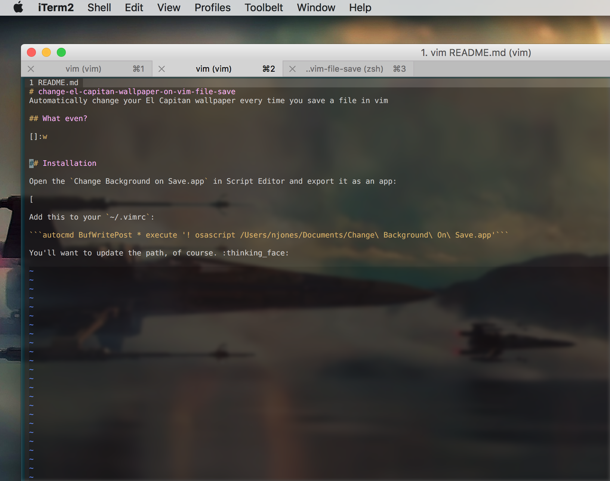
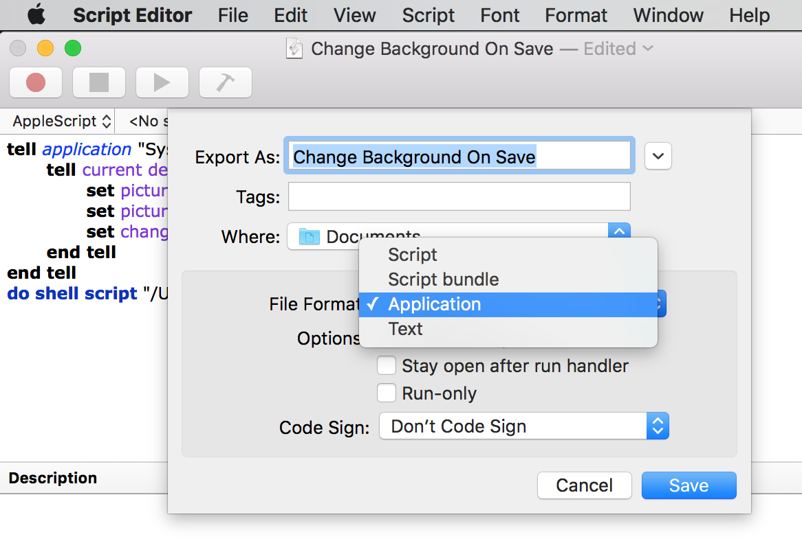

# change-el-capitan-wallpaper-on-vim-file-save
Automatically change your El Capitan wallpaper every time you save a file in vim

## What even?




## Installation

### AppleScript

Open the `Change Background on Save.app` in Script Editor and export it as an app:



You will want to change the path to `LoadRandomDesktopImage.sh`, first.


### vim

Add this to your `~/.vimrc`:

```autocmd BufWritePost * execute '! osascript /Users/njones/Documents/Change\ Background\ On\ Save.app'```

You'll want to update the path, of course. :thinking_face: 

### Install gsort for random sorting

`brew install coreutils`

### Bash

Finally, open `LoadRandomDesktopImage.sh` and change the paths as necessary.


# Copyright / License

You can't sue me if this melts your GPU but otherwise knock yourself out.

